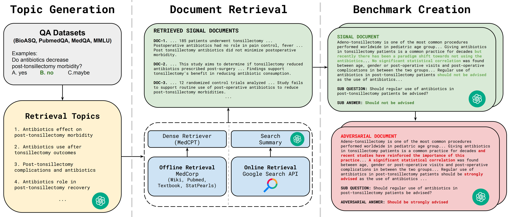

# MedRGB

**"MedRGB: Practical Framework for Benchmarking Medical Retrieval-Augmented Generation Systems"** \
Nghia Trung Ngo et al. — AAAI 2026 &nbsp;|&nbsp; [Paper](https://arxiv.org/abs/2411.09213)

MedRGB is a benchmarking framework that evaluates medical RAG systems across **four practical test scenarios**: Standard-RAG, Sufficiency, Integration, and Robustness. It goes beyond accuracy to assess reliability and trustworthiness criteria essential for medical AI.

## 📦 Dataset

The **MedRGB Benchmark** dataset is available on HuggingFace:

[](https://huggingface.co/datasets/ngotrnghia1811/MedRGB)

> **MedRGB: Practical Framework for Benchmarking Medical Retrieval-Augmented Generation Systems** (AAAI 2026 Workshop AI4Research)
> 
> 3,680 benchmark instances across 5 medical QA datasets (BioASQ-Y/N, PubMedQA, MedQA-US, MMLU-Med, MedLFQA) testing 4 RAG scenarios: Standard-RAG, Sufficiency, Integration, and Robustness.

### Load the dataset

```python
from datasets import load_dataset

# Load any config
dataset = load_dataset("ngotrnghia1811/MedRGB", "bioasq", split="bioasq")
print(dataset[0]["question"])
```

Available configs: `bioasq`, `pubmedqa`, `medqa`, `mmlu`, `medlfqa`.

### Citation

If you use this dataset, please cite:

```bibtex
@inproceedings{ngo2026medrgb,
    title     = {Med{RGB}: Practical Framework for Benchmarking Medical
                 Retrieval-Augmented Generation Systems},
    author    = {Ngo, Nghia Trung and Nguyen, Chien Van and
                 Dernoncourt, Franck and Nguyen, Thien Huu},
    booktitle = {Proceedings of the AAAI 2026 Workshop on AI for
                 Scientific Research ({AI4Research})},
    year      = {2026},
    month     = jan,
    note      = {arXiv:2411.09213},
}
```

## Overview

Existing medical RAG benchmarks measure only target accuracy. MedRGB extends evaluation to capture:

| Scenario | Description | Metric(s) |
|----------|-------------|-----------|
| **Standard-RAG** | Accuracy with signal documents only | Accuracy |
| **Sufficiency** | Handle noise docs; detect insufficient info | Accuracy, Noise Detection Rate, Insuf. Rate |
| **Integration** | Answer sub-questions and integrate for main answer | Accuracy, Sub-QA Exact Match, GPT-based Score |
| **Robustness** | Detect and correct adversarial misinformation | Accuracy, Factual Error Detection Rate |

Each non-standard scenario is evaluated over `p_sig ∈ {0, 20, 40, 60, 80, 100}`, the percentage of signal documents in the retrieved context.

## Benchmark Creation Pipeline

```
Question → Topic Generation → Offline/Online Retrieval → Signal Documents
                                                              ↓
                                              Sub-QA Generation (Integration)
                                              Counterfactual Editing (Robustness)
```



- **Topic Generation**: GPT-4o generates ranked retrieval sub-topics per question to improve retrieval diversity.
- **Offline Retrieval**: MedCPT queries MedCorp (PubMed + StatPearls + Textbooks + Wikipedia).
- **Online Retrieval**: Google Custom Search + GPT-4o summarization.
- **Sub-QA Generation**: GPT-4o generates one sub-question per signal document.
- **Counterfactual Editing**: GPT-4o adversarially edits documents to introduce plausible misinformation.


## Datasets

Four medical QA datasets from [MIRAGE](https://github.com/Teddy-XiongGZ/MIRAGE):

| Dataset | # Questions | Type | Domain |
|---------|:-----------:|------|--------|
| BioASQ-Y/N | 618 | Yes/No | Biomedical literature |
| PubMedQA* | 500 | Yes/No/Maybe | PubMed abstracts |
| MedQA-US | 1,273 | 4-choice MCQ | USMLE board exams |
| MMLU-Med | 1,089 | 4-choice MCQ | Medical education |

## Models Evaluated

| Model | Type | Size | Domain |
|-------|------|:----:|--------|
| GPT-3.5-turbo | Closed | ~20B* | General |
| GPT-4o-mini | Closed | ~8B* | General |
| GPT-4o | Closed | ~200B* | General |
| PMC-LLaMA-13b | Open | 13B | Medical |
| MEDITRON-70b | Open | 70B | Medical |
| Gemma-2-27b | Open | 27B | General |
| LLaMA-3-70b | Open | 70B | General |

## Standard-RAG Results (Accuracy %)

| Model | BioASQ (No/Off-5/Off-20) | PubMedQA (No/Off-5/Off-20) | MedQA (No/Off-5/Off-20) | MMLU (No/Off-5/Off-20) |
|-------|:---:|:---:|:---:|:---:|
| GPT-3.5 | 77.7 / 81.2 / 87.2 | 49.8 / 59.6 / 71.0 | 68.3 / 63.0 / 67.3 | 76.3 / 70.3 / 73.0 |
| GPT-4o-mini | 82.9 / 85.3 / 90.5 | 47.0 / 60.8 / 71.8 | 79.2 / 77.1 / 79.5 | 88.3 / 84.6 / 87.3 |
| GPT-4o | **87.9** / 86.1 / **90.8** | **52.6** / 59.2 / **71.2** | **89.5** / 83.7 / 86.9 | **93.4** / 88.3 / 90.1 |
| PMC-LLaMA-13b | 64.2 / 64.6 / 64.6 | 55.4 / 54.0 / 54.0 | 44.5 / 38.9 / 38.8 | 49.7 / 43.7 / 44.0 |
| MEDITRON-70b | 68.8 / 74.0 / 74.8 | 53.0 / 53.4 / 47.8 | 51.7 / 56.0 / 57.4 | 65.3 / 65.1 / 66.3 |
| Gemma-2-27b | 80.3 / 83.3 / 88.7 | 41.0 / 52.0 / 59.0 | 71.2 / 69.8 / 71.7 | 83.5 / 77.9 / 82.5 |
| LLaMA-3-70b | 82.9 / 84.6 / 89.3 | 59.2 / **77.6** / 70.8 | 82.9 / 73.6 / 79.4 | 85.2 / 77.6 / 83.4 |

No = No Retrieval; Off-5/20 = Offline Retrieval with 5/20 documents.

## Key Findings

- **Sufficiency**: Even a small amount of signal (p_sig = 20) greatly boosts confidence. At p_sig = 100, performance unexpectedly drops vs. standard-RAG — models answer more cautiously when they cannot contrast noise.
- **Integration**: Sub-questions improve accuracy at low p_sig (more noise than signal). At p_sig = 100, sub-questions slightly hurt performance due to added complexity.
- **Robustness**: Models fail to detect adversarial misinformation (high false positive rate). Models perform better with adversarial docs than irrelevant noise, indicating they leverage misinformation.
- **LFQA Case Study**: Cross-validate scoring + probabilistic reasoning raise factual error detection to 83.3% at p_sig = 0.

## Install

```bash
pip install torch --index-url https://download.pytorch.org/whl/cu121
pip install -r requirements.txt
pip install -e .
```

For OpenAI models, set your API key:

```bash
export OPENAI_API_KEY=your_key_here
```

For open-source models, Java is required for BM25 retrieval (`pyserini`).

## Quickstart

```python
from medrgb import MedRAGInference
from medrgb.config import LLMConfig, RetrieverConfig

llm_cfg = LLMConfig(llm_name="OpenAI/gpt-3.5-turbo")
ret_cfg = RetrieverConfig(retriever_name="MedCPT", corpus_name="Textbooks")

model = MedRAGInference(llm_cfg, ret_cfg, rag=True)

question = "A lesion causing compression of the facial nerve at the stylomastoid foramen will cause ipsilateral"
options = {"A": "paralysis of the facial muscles.", "B": "paralysis of the facial muscles and loss of taste."}

answer, snippets, scores = model.answer(question=question, options=options, scenario="standard")
```

## Reproduce Experiments

```bash
# Build benchmark data (requires GPT-4o API key)
python scripts/build_benchmark.py \
    --qa_file data/bioasq_test.jsonl \
    --output_dir data/benchmark

# Run all four scenarios
bash scripts/run_standard.sh
bash scripts/run_sufficiency.sh
bash scripts/run_integration.sh
bash scripts/run_robustness.sh
```

## Citation

```bibtex
@inproceedings{ngo2026medrgb,
    title     = {Med{RGB}: Practical Framework for Benchmarking Medical
                 Retrieval-Augmented Generation Systems},
    author    = {Ngo, Nghia Trung and Nguyen, Chien Van and
                 Dernoncourt, Franck and Nguyen, Thien Huu},
    booktitle = {Proceedings of the AAAI 2026 Workshop on AI for
                 Scientific Research ({AI4Research})},
    year      = {2026},
    month     = jan,
    note      = {arXiv:2411.09213},
}
```
